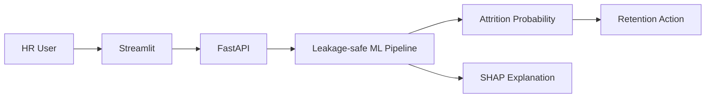

# 🌍 Green Destinations Employee Attrition Analysis

### Explainable Employee Attrition Risk Prediction System

An end-to-end HR analytics and ML system that predicts **employee attrition risk**, explains individual predictions with SHAP, and converts risk into practical retention actions.

> **Purpose:** I created this project to demonstrate how machine learning can move from a simple attrition prediction to an explainable HR decision-support workflow.

## 🎯 Problem

Employee turnover creates recruitment, training and productivity costs. The system helps HR teams identify higher-risk employees and understand the factors contributing to that risk.

## 🏗️ Architecture



## ✨ Engineering Highlights

- Leakage-safe preprocessing with `ImbPipeline`
- One-hot encoding and SMOTE inside the training pipeline
- GridSearchCV with stratified cross-validation
- Validation-based **F2 threshold optimization**
- Untouched final test set for unbiased evaluation
- Production refit using train + validation data
- SHAP individual explanations
- Pydantic API validation
- `/health` model-health endpoint
- Model metadata saved after training

## 📊 Evaluation

Reported metrics include:

**ROC-AUC · PR-AUC · Recall · Precision · F1 · F2 · Confusion Matrix**

Run training to generate current metrics:

```bash
python src/train.py
```

## 🔌 API

```text
POST /predict
GET  /health
GET  /docs
```

Example response:

```json
{
  "attrition_probability": 0.72,
  "risk_level": "High",
  "tuned_threshold": 0.30,
  "action": "Immediate retention interview suggested"
}
```

## 🖥️ Dashboard

```bash
streamlit run app/main.py
```

The dashboard accepts employee information and displays risk, probability and SHAP-based explanations.

## 🚀 Setup

```bash
pip install -r requirements.txt
pip install -r requirements-dev.txt
python src/train.py
uvicorn app.api_secure:app --reload --port 8000
streamlit run app/main.py
pytest -q
```

## 🐳 Docker

```bash
docker build -t attrition-system .
docker run -p 8000:8000 -p 8501:8501 attrition-system
```

## 📁 Structure

```text
data/        # HR dataset
models/      # trained artifacts + metadata
src/         # features, schemas and training
app/         # API + Streamlit application
tests/       # automated tests
Dockerfile
requirements.txt
```

## 🔐 Production Considerations

The current system is portfolio/production-oriented but still requires environment-specific hardening before real HR deployment. Recommended next steps are authentication, rate limiting, model registry, drift monitoring, fairness analysis and automated retraining.

## 🗺️ Roadmap

- [ ] Data/model drift monitoring
- [ ] Model registry and experiment tracking
- [ ] Fairness analysis
- [ ] Authentication and rate limiting
- [ ] Automated retraining
- [ ] Cost-sensitive retention optimization

## 👨‍💻 Author

**Piyush Ramteke** — Data Scientist | AI/ML Engineer
