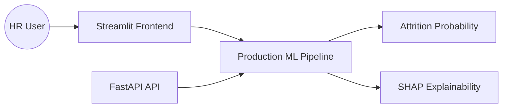

<!-- HEADER -->
<div align="center">


</div>

# 🌍 Green Destinations Employee Attrition Analysis

[](https://green-destinations-employee-attrition-analysis.streamlit.app/)

> End-to-end HR analytics and machine-learning system for employee attrition risk prediction, threshold optimization, API serving, and SHAP explainability.


## 🎯 Problem Statement

Employee attrition creates recruitment, training, and productivity costs. This project predicts attrition risk and explains the factors behind an individual prediction so HR teams can prioritize retention actions.

## 🏗️ Architecture



### Engineering highlights

- **Leakage-safe ML pipeline:** preprocessing, one-hot encoding, SMOTE, and Random Forest are kept inside a single `ImbPipeline`.
- **Hyperparameter tuning:** `GridSearchCV` with stratified cross-validation.
- **Threshold optimization:** threshold is selected on a validation set using **F2**, giving recall greater weight than precision.
- **Unbiased evaluation:** the final test set remains untouched until final evaluation.
- **Production refit:** the selected model is retrained on train + validation data before being saved.
- **Explainable AI:** SHAP identifies features contributing to an individual prediction.
- **Validated API:** Pydantic request validation rejects malformed or incomplete employee records.
- **Health endpoint:** `/health` reports whether the model is loaded.
- **Metadata:** training writes the selected threshold and final evaluation metrics to `models/model_metadata.json`.

## 📊 Model Evaluation

The project reports:

| Metric | Purpose |
| :--- | :--- |
| ROC-AUC | Overall ranking/discrimination |
| PR-AUC | Performance under class imbalance |
| Recall | How many potential leavers are detected |
| Precision | How many flagged employees are actual leavers |
| F1 | Balance between precision and recall |
| F2 | Recall-focused threshold selection |
| Confusion Matrix | False-positive / false-negative analysis |

**Important:** run `python src/train.py` after cloning to generate the current model metadata and refresh the evaluation numbers. The threshold is no longer selected using the final test set.

## 🚀 API

### `POST /predict`

The endpoint accepts a validated employee profile and returns:

```json
{
  "attrition_probability": 0.72,
  "risk_level": "High",
  "tuned_threshold": 0.30,
  "action": "Immediate retention interview suggested"
}
```

### `GET /health`

Returns model availability and service health.

Interactive API documentation is available from FastAPI at `/docs` when the service is running.

## 📊 Dataset

The project uses `data/hr_data.csv` containing 1,470 employee records.

Engineered features include:

- `IncomePerAge`
- `TenureRatio`

## 🖥️ Streamlit Dashboard

The dashboard provides:

- Employee profile inputs
- Attrition probability
- Validation-selected decision threshold
- High/Low risk classification
- SHAP feature explanation

## 💻 Tech Stack

- Python 3.10+
- pandas / NumPy
- scikit-learn
- imbalanced-learn
- Random Forest
- SHAP
- FastAPI / Uvicorn
- Streamlit
- Docker
- Pytest

## 📂 Project Structure

```text
Green-Destinations-Employee-Attrition-Analysis/
├── data/
│   └── hr_data.csv
├── models/
│   ├── model_pipeline.pkl
│   ├── shap_background.pkl
│   └── model_metadata.json        # generated after training
├── src/
│   ├── config.py
│   ├── features.py
│   ├── schemas.py
│   └── train.py
├── app/
│   ├── api.py                     # legacy API retained for compatibility
│   ├── api_secure.py              # validated production API
│   └── main.py                    # Streamlit UI
├── tests/
│   ├── test_api.py
│   └── test_features.py
├── requirements.txt
├── requirements-dev.txt
└── Dockerfile
```

## ⚙️ Run Locally

```bash
pip install -r requirements.txt
pip install -r requirements-dev.txt

# Train, tune threshold, evaluate, and save the production model
python src/train.py

# FastAPI
uvicorn app.api_secure:app --reload --port 8000

# Streamlit
streamlit run app/main.py

# Tests
pytest -q
```

## 🐳 Docker

```bash
docker build -t attrition-system .
docker run -p 8000:8000 -p 8501:8501 attrition-system
```

## 🔮 Future Improvements

- Data/model drift monitoring
- Model registry and experiment tracking
- Cost-sensitive retention optimization
- Automated retraining pipeline
- Fairness analysis across employee groups
- Authentication and rate limiting for the API

## 👨‍💻 Author

**Piyush Ramteke** — Data Scientist | AI/ML Engineer

[GitHub](https://github.com/Piyu242005) · [LinkedIn](https://www.linkedin.com/in/piyush-ramteke-24-mylife)
