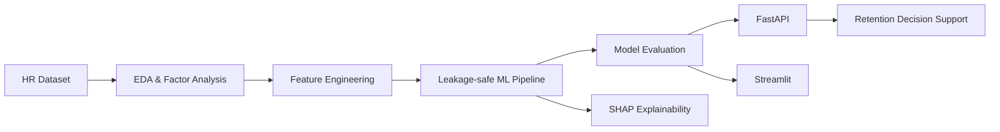

# 🌍 Green Destinations Employee Attrition Analysis

### Explainable Employee Attrition Risk Prediction System

An end-to-end HR analytics and machine-learning system for employee attrition analysis, visual exploration, explainable risk prediction, and API-based serving.

> **Purpose:** This project demonstrates the complete journey from HR data exploration and factor analysis to machine-learning deployment.

## 🖼️ Screenshot Gallery

### 1. Load and Explore the Data

<p align="center"></p>

### 2. Calculate Attrition Rate

<p align="center"></p>

### 3. Factor Analysis — Age vs Attrition

<p align="center"></p>

### 4. Factor Analysis — Years at Company vs Attrition

<p align="center"></p>

### 5. Factor Analysis — Monthly Income vs Attrition

<p align="center"></p>

### 6. Summary & Key Findings

<p align="center"></p>

### 7. Summary & Key Findings — Alternate View

<p align="center"></p>

### 🚀 FastAPI Backend

<p align="center"></p>

### 🖥️ Streamlit Dashboard

<p align="center"></p>

### 📌 Project Preview

<p align="center"></p>

## 🎯 Problem

Employee turnover creates recruitment, training and productivity costs. The project analyzes attrition patterns and provides an ML-based decision-support workflow for identifying higher-risk employees.

## 🏗️ Architecture



## ✨ Engineering Highlights

- HR data exploration and attrition-rate analysis
- Factor analysis across age, tenure and income
- Leakage-safe preprocessing with `ImbPipeline`
- One-hot encoding and SMOTE
- GridSearchCV with stratified cross-validation
- Validation-based **F2 threshold optimization**
- Untouched final test set for evaluation
- SHAP individual explanations
- Model comparison benchmarking
- Data/prediction drift monitoring utilities
- Fairness and representation analysis
- Pydantic API validation
- `/health` model-health endpoint
- HR analytics dashboard
- Responsible-AI model card

## 📊 Evaluation

**ROC-AUC · PR-AUC · Recall · Precision · F1 · F2 · Confusion Matrix**

Generate current model metrics with:

```bash
python src/train.py
```

## 🔌 API

```text
POST /predict
GET  /health
GET  /docs
```

## 🖥️ Applications

```bash
streamlit run app/main.py
streamlit run app/analytics_dashboard.py
uvicorn app/advanced_api:app --reload --port 8000
```

## 🚀 Setup

```bash
pip install -r requirements.txt
pip install -r requirements-dev.txt
python src/train.py
pytest -q
```

## 📁 Structure

```text
data/        # HR dataset
models/      # trained artifacts + metadata
src/         # feature engineering, training, comparison, monitoring
app/         # FastAPI + Streamlit applications
screenshots/ # Project screenshot gallery
tests/       # automated tests
docs/        # production checklist
MODEL_CARD.md
Dockerfile
requirements.txt
```

## 🔐 Responsible AI

This is an **HR decision-support system**, not an automated employment decision-maker. Predictions should be reviewed by qualified HR professionals and should not independently determine hiring, termination, promotion or compensation decisions.

## 👨‍💻 Author

**Piyush Ramteke** — Data Scientist | AI/ML Engineer
