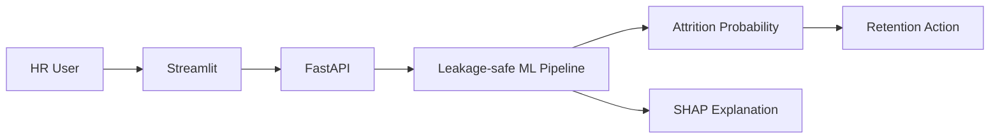

# 🌍 Green Destinations Employee Attrition Analysis

### Explainable Employee Attrition Risk Prediction System

An end-to-end HR analytics and machine-learning system that predicts **employee attrition risk**, explains individual predictions with SHAP, and converts risk into practical retention actions.

> **Purpose:** I created this project to demonstrate how machine learning can move from attrition prediction to an explainable HR decision-support workflow.

## 🖥️ Project Screenshots

### 🔮 Attrition Risk Prediction


### 🧠 Explainable AI — SHAP Analysis


### 📊 HR Analytics Dashboard


### 🔌 FastAPI Swagger Documentation


> **Note:** The screenshot files are stored in `assets/` so the README remains self-contained and does not depend on external image hosting.

## 🎯 Problem

Employee turnover creates recruitment, training and productivity costs. The system helps HR teams identify higher-risk employees and understand the factors contributing to that risk.

## 🏗️ Architecture



## ✨ Engineering Highlights

- Leakage-safe preprocessing with `ImbPipeline`
- One-hot encoding and SMOTE inside the training pipeline
- GridSearchCV with stratified cross-validation
- Validation-based **F2 threshold optimization**
- Untouched final test set for unbiased evaluation
- SHAP individual explanations
- Model comparison benchmarking
- Data/prediction drift monitoring utilities
- Fairness and representation analysis
- Pydantic API validation
- `/health` model-health endpoint
- Model metadata generated after training
- HR analytics dashboard
- Responsible-AI model card

## 📊 Evaluation

Reported metrics include:

**ROC-AUC · PR-AUC · Recall · Precision · F1 · F2 · Confusion Matrix**

Run training to generate current metrics:

```bash
python src/train.py
```

## 🔌 API

```text
POST /predict
GET  /health
GET  /docs
```

## 🖥️ Applications

Prediction dashboard:

```bash
streamlit run app/main.py
```

HR analytics dashboard:

```bash
streamlit run app/analytics_dashboard.py
```

Validated production-oriented API:

```bash
uvicorn app/advanced_api:app --reload --port 8000
```

## 🚀 Setup

```bash
pip install -r requirements.txt
pip install -r requirements-dev.txt
python src/train.py
pytest -q
```

## 🐳 Docker

```bash
docker build -t attrition-system .
docker run -p 8000:8000 -p 8501:8501 attrition-system
```

## 📁 Structure

```text
data/        # HR dataset
models/      # trained artifacts + metadata
src/         # feature engineering, training, comparison, monitoring
app/         # FastAPI + Streamlit applications
assets/      # README project screenshots
tests/       # automated tests
docs/        # production checklist
MODEL_CARD.md
Dockerfile
requirements.txt
```

## 🔐 Responsible AI

This is an **HR decision-support system**, not an automated employment decision-maker. Predictions should be reviewed by qualified HR professionals and should not independently determine hiring, termination, promotion or compensation decisions.

See [`MODEL_CARD.md`](MODEL_CARD.md) for intended use, limitations, evaluation and responsible-AI guidance.

## 👨‍💻 Author

**Piyush Ramteke** — Data Scientist | AI/ML Engineer
